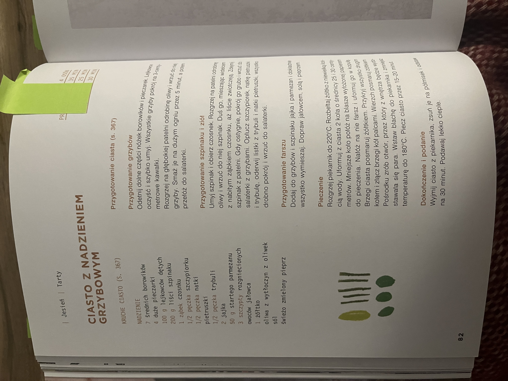
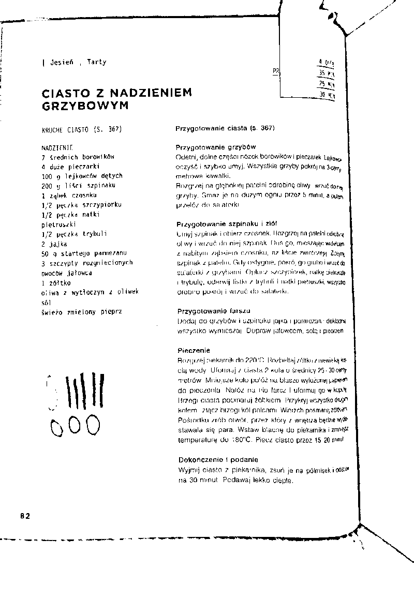

# page-dewarp-swift

iOS/Swift port of the [page-dewarp](https://github.com/lemonzi/page-dewarp) document image dewarping library. Converts warped or curved page photos into flat, thresholded output images using a cubic sheet model.

> **Note:** This repository was generated by an autonomous [Claude Code](https://claude.ai/code) agent loop. See [docs/development-process.md](docs/development-process.md) for details on how the port was created and validated.

## Comparison

| Input | Python reference | Swift port |
|:-----:|:---------------:|:----------:|
|  |  |  |

Both implementations produce visually correct, flat, readable output. Pixel match with the Python reference is ~96% on this image.

## How It Works

The pipeline detects curved text lines in a page photo, fits a 3D cubic surface model, and reprojects the image onto a flat plane:

1. **Resize** input to working resolution
2. **Detect** text contours via adaptive thresholding + morphology
3. **Assemble** contours into horizontal spans
4. **Sample** keypoints along each span
5. **Estimate** initial 3D pose via pure-Swift DLT (Direct Linear Transform)
6. **Optimize** cubic surface parameters (L-BFGS-B with analytical gradients)
7. **Remap** the original image through the optimized surface model
8. **Threshold** the result into a clean binary image

See [docs/architecture.md](docs/architecture.md) for the full module breakdown.

## Requirements

- Xcode 15+ (tested with Xcode 26 beta)
- iOS 16.0+ deployment target
- [XcodeGen](https://github.com/yonaskolb/XcodeGen): `brew install xcodegen`
- [CocoaPods](https://cocoapods.org/): `gem install cocoapods`

## Setup

```bash
git clone https://github.com/erykpiast/page-dewarp-swift.git
cd page-dewarp-swift
xcodegen generate
pod install
open PageDewarp.xcworkspace
```

## Usage

```swift
import PageDewarp

let image: UIImage = ...  // your page photo
let result = DewarpPipeline.process(image: image)

switch result {
case .success(let dewarped):
    // dewarped is a thresholded UIImage
    imageView.image = dewarped
case .failure(let error):
    print("Dewarping failed: \(error)")
}
```

## Integration

### CocoaPods

Add to your `Podfile`:

```ruby
pod 'PageDewarp', '~> 2.0'
```

`opencv-rne` is pulled in automatically as a peer dependency. The library only requires OpenCV's `core` and `imgproc` modules — `calib3d` is not needed.

### Swift Package Manager

SPM support requires that the consumer provides OpenCV as a binary target (see `Package.swift` for the expected target name `opencv2`).

## Running Tests

```bash
xcodebuild test \
  -workspace PageDewarp.xcworkspace \
  -scheme PageDewarp \
  -destination 'platform=iOS Simulator,name=iPhone 16'
```

## Project Structure

```
Sources/
  Core/               13 Swift files implementing the dewarp algorithm
  OpenCVBridge/       ObjC++ wrapper exposing OpenCV to Swift
Tests/                14 test files + golden reference data
App/                  Minimal SwiftUI demo app
docs/                 Architecture, differences from Python, development process
```

## Documentation

- [API Reference](docs/API.md) -- public API, configuration options, usage modes
- [Architecture](docs/architecture.md) -- pipeline diagram, module responsibilities
- [Differences from Python](docs/differences.md) -- what changed and why
- [Development Process](docs/development-process.md) -- how this port was built by an autonomous agent loop

## Related Projects

- [page-dewarp](https://github.com/lemonzi/page-dewarp) -- Original Python implementation by Matt Zucker (2016), refactored for Python 3.10+
- [page-dewarp-js](https://github.com/erykpiast/page-dewarp-js) -- JavaScript port using opencv-wasm

## License

MIT License. Copyright (c) 2016 Matt Zucker, 2025 Eryk Napierala. See [LICENSE](LICENSE).
